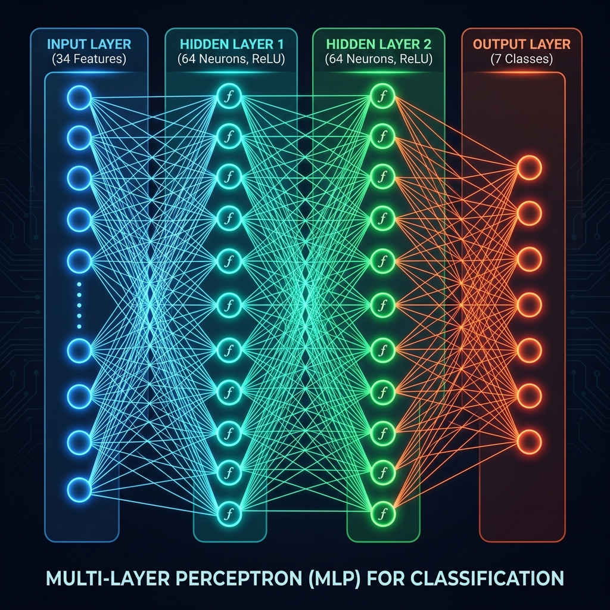

# Date Fruit Classification (PyTorch)

A PyTorch-based classification model using an Artificial Neural Network (ANN) to classify date fruits into 7 different varieties. The classification is based on 34 features representing morphologic characteristics, color, and texture of the fruits.

---

## Dataset & Features

The dataset (`DateFruit_Dataset.csv`) contains 898 records of date fruits belonging to 7 different classes.

The model uses 34 input variables representing:
* **Morphological features**: Area, Perimeter, Major/Minor Axis length, Eccentricity, Convex Area, Solidity, Extent, Roundness, etc.
* **Color features**: Red, Green, and Blue channel statistics (Mean, StdDev, Skewness, Kurtosis, Entropy) for the date fruit images.
* **Texture features**: Wavelet transform coefficients (ALLdaub4RR, ALLdaub4RG, ALLdaub4RB).

**Target variable:**
* **Class**: The variety of the date fruit (7 distinct classes: BERHI, DEGLET, DOKHI, IRAQI, KARAWI, SAFAVI, SOTRY).

---

## Model Architecture

The neural network is built with PyTorch and has the following layer structure:
* **Input Layer**: 34 inputs (corresponding to the scaled morphologic and color/texture features)
* **Hidden Layer 1**: 64 neurons with ReLU activation
* **Hidden Layer 2**: 64 neurons with ReLU activation
* **Output Layer**: 7 neurons (raw logits corresponding to the 7 date fruit classes)

### Network Structure



```
Input (34 features) ──> Dense (64) ──> ReLU ──> Dense (64) ──> ReLU ──> Output (7)
```

---

## Training Setup

* **Preprocessing**: The target class labels are encoded using Scikit-Learn's `LabelEncoder`. The features are split into training (80%) and testing (20%) sets, then normalized using Scikit-Learn's `StandardScaler`.
* **Optimization**: The model is trained using the **Adam** optimizer and **Cross-Entropy Loss** (`nn.CrossEntropyLoss`) over 100 epochs with a batch size of 32.
* **Evaluation**: Accuracy is monitored during testing. The model achieves a classification accuracy of **95.0%** on the test dataset.

---

## Repository Structure

* `ANN_Classification.ipynb` - Jupyter notebook containing data loading, preprocessing, model definition, training, and evaluation.
* `DateFruit_Dataset.csv` - The date fruit dataset containing morphological, color, and texture features.
* `model_architecture.png` - Standard block diagram representation of the network (referenced in this README).
* `.gitignore` - Standard configuration to exclude notebook checkpoint directories and Python cache files.
* `README.md` - Project documentation (this file).

---

## Setup and Running

To run this notebook, you will need PyTorch, Scikit-Learn, Pandas, Numpy, and Jupyter.

1. **Install requirements:**
   ```bash
   pip install torch pandas numpy scikit-learn jupyter
   ```

2. **Launch the notebook:**
   ```bash
   jupyter notebook ANN_Classification.ipynb
   ```
